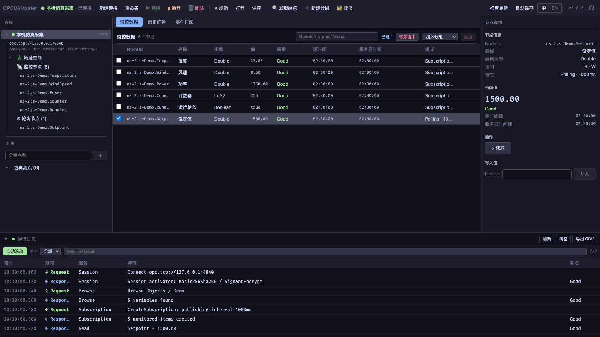
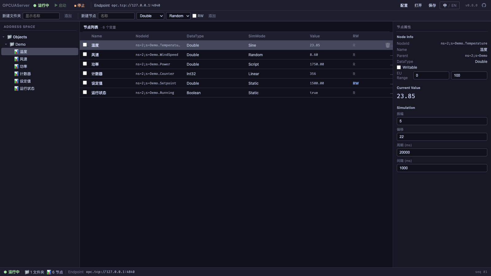
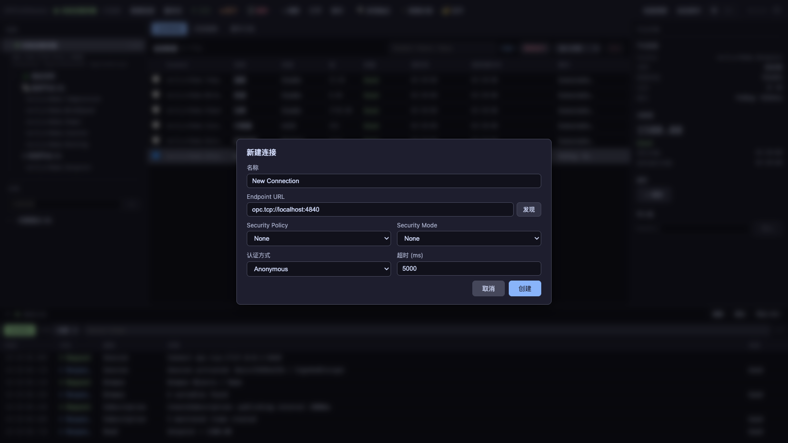

<div align="center">

# 🔌 OPCUASim

**A cross-platform OPC UA simulator — Server and Master, in one desktop toolkit.**

[](https://github.com/Karl-Dai/OPCUASim/releases) [](https://github.com/Karl-Dai/OPCUASim/releases) [](https://github.com/Karl-Dai/OPCUASim/stargazers) [](#license) 

Built with **Rust** · **Tauri 2** · **Vue 3** · **async-opcua**

**English** · [中文](README_CN.md)


<br>
<sub>Address-space simulation → subscriptions / polling → reads, writes and history → service logs</sub>

</div>

---

## Why this project

An OPC UA device is not always available when you need to test acquisition, history or a device interface. OPCUASim puts **both ends on your desktop**:

- 🏭 **Server and Master in one repository** — create simulated variables in `OPCUAServer`, connect with `OPCUAMaster`, or use the Master against an existing device.
- 📡 **Subscriptions and polling together** — choose server-pushed updates or periodic reads per node, with values, quality and timestamps visible.
- 🎛️ **Configurable variable simulation** — static, random, sine, linear and script modes for changing values, limits and write scenarios.
- 🗂️ **Persistent acquisition configuration** — the Master remembers connections, nodes, intervals, filters and groups; reconnect after restarting to resume acquisition.
- 🖥️ **Cross-platform desktop apps** — Windows x64 / ARM64, macOS Apple Silicon / Intel and Linux x64.
- 🌏 **Bilingual UI** — switch both apps between English and Simplified Chinese with **中 / EN**.

| Application | Purpose |
|---|---|
| **OPCUAServer** | Provide an OPC UA server with configurable address space, variables and simulation modes |
| **OPCUAMaster** | Connect to devices, browse nodes, acquire data, read/write values, read history and call methods |

## Table of Contents

- [Screenshots](#screenshots)
- [Features](#features)
- [Workspace save and restore](#workspace-save-and-restore)
- [Security and certificates](#security-and-certificates)
- [Download](#download)
- [Build from Source](#build-from-source)
- [Quick Start](#quick-start)
- [Protocol Support](#protocol-support)
- [Architecture](#architecture)
- [Contributing](#contributing)
- [Changelog](#changelog)
- [macOS First Launch](#macos-first-launch)
- [License](#license)

## Screenshots

These captures show the v0.8.0 frontend with local example nodes and mocked backend data. They illustrate the UI, without real device or site acquisition data.

**Server · address space and variable simulation**

Browse folders and variables on the left, inspect types, simulation modes, values and access flags in the table, and edit the selected node's simulation settings on the right.



**Master · subscriptions, polling and service logs**

The connection tree separates subscriptions from polling. The table shows values, quality and timestamps; the right panel provides reads and writes, while the bottom log records OPC UA service requests and responses.


**Master · connections and endpoint discovery**

Configure the endpoint, security policy, message security mode and user identity. Endpoint discovery helps select a combination the server actually provides.



## Features

### 🏭 Server — `OPCUAServer`

- **OPC UA server** — defaults to `opc.tcp://127.0.0.1:4840`, with configurable bind host, port and application URI.
- **Folders and variables** — organize the address space under `Objects`; add, edit and remove variables.
- **Common scalar types** — Boolean, integers, Float / Double, String, DateTime and ByteString.
- **Five simulation modes** — `Static`, `Random`, `Sine`, `Linear` (Repeat / Bounce) and `Script` (`evalexpr` expressions).
- **Per-node settings** — update interval, bounds, amplitude, offset, period and expressions, with current values in the table.
- **Writable variables** — enable `RW` for client writes; external writes to Static nodes appear in the Server UI.
- **History and events** — the core provides in-memory history buffers, aggregate reads, events and event history for service testing with the Master.
- **Project files** — manually save and load `.opcuaproj` files containing server settings, folders, variables and simulation definitions.

### 📡 Master — `OPCUAMaster`

- **Multiple connections** — create, connect, disconnect and remove connections; rename from the toolbar or by double-clicking a name while preserving the active session.
- **Endpoint discovery and authentication** — choose advertised security policies and message modes; anonymous, username/password and X.509 user certificate identities.
- **Address-space browsing** — lazily expand Object / Variable / Method nodes, select variables, or collect variables beneath an object.
- **Subscriptions and polling** — set the mode and interval per node; subscriptions support data-change triggers and absolute / percentage deadbands.
- **Monitoring table** — search NodeIds, names or values; inspect quality and source/server timestamps; remove multiple nodes or assign them to groups.
- **Reads and writes** — inspect node attributes and write values to variables with write access.
- **Historical trends** — raw, aggregate and event history, with time ranges, plots and tables.
- **Event subscriptions** — select an event source and inspect time, severity, source and message.
- **Method calls** — discover input/output argument definitions, enter parameters and inspect results.
- **Service logs** — filter requests/responses, search services and details, and export CSV.
- **Autosave and restore** — persist connection names/settings, monitored nodes, intervals, filters and groups locally.
- **In-app updates** — startup and manual checks, download progress and signature verification, with immediate, next-launch or skip choices.

### Simulation modes

| Mode | Behavior | Example use |
|---|---|---|
| Static | Keep the configured value; writable nodes accept client writes | Setpoints, status flags and write tests |
| Random | Generate values within bounds at the configured interval | Sampling and range tests |
| Sine | Generate a sine wave from amplitude, offset and period | Smooth changes and trend tests |
| Linear | Increment by a step, then repeat or bounce at bounds | Counters, ramps and boundary tests |
| Script | Evaluate an expression with `t` and `iteration` | Custom changes such as `t * 0.1` |

## Workspace save and restore

The **Master** saves its local workspace after configuration changes and restores it on startup. This includes connection IDs/names, endpoints and identity configuration, monitored nodes, subscription/polling intervals, filters and groups. Restored connections are **disconnected**; click **Connect** to resume acquisition. The toolbar shows autosave status and errors.

Use **Save / Open** to explicitly export or import `.opcuaproj` files. Master projects include monitored nodes. **Server** projects contain server settings, the address space and simulation definitions; the current Server requires manual save/open.

Projects store configuration, not running sessions, live values, history buffers or event records. Certificates and private keys are referenced by path and must remain accessible after moving a project to another computer. If an older project omitted monitored nodes, add them once after upgrading.

Passwords in identity configuration may be stored in plaintext in project files or local workspace data. Remove credentials and sensitive device addresses before sharing; private-key files are not bundled with a project.

## Security and certificates

The **security policy, message security mode and user identity** must match the selected server endpoint.

- **Server defaults:** `Basic256Sha256` / `SignAndEncrypt`, anonymous access enabled, binding to `127.0.0.1`. Configure an application certificate and matching key, or use the generated certificate.
- **Master defaults:** new connections start with `None` / `None`. To connect to the default Server, discover endpoints and select `Basic256Sha256` / `SignAndEncrypt`.
- **Trust behavior:** the Master currently trusts server certificates automatically. The Server also trusts client application certificates by default; this Server setting can be disabled. The Master provides PKI certificate listing, trust/reject and deletion controls.
- **User roles:** Server accounts can record ReadOnly / ReadWrite / Admin roles, but this metadata does not yet enforce per-node RBAC. Node write access is controlled by the writable setting.

For local testing, keep the default bind address. To accept another computer, bind to the intended interface or `0.0.0.0` and use the Server's actual IP in the Master; ensure the selected port is reachable.

## Download

Install **both apps** for the local tutorial. The table links to [actual v0.8.0 release assets](https://github.com/Karl-Dai/OPCUASim/releases/tag/v0.8.0); see [Releases](https://github.com/Karl-Dai/OPCUASim/releases) for newer versions.

| Platform / format | Server | Master |
|---|---|---|
| macOS Apple Silicon | [OPCUAServer_0.8.0_aarch64.dmg](https://github.com/Karl-Dai/OPCUASim/releases/download/v0.8.0/OPCUAServer_0.8.0_aarch64.dmg) | [OPCUAMaster_0.8.0_aarch64.dmg](https://github.com/Karl-Dai/OPCUASim/releases/download/v0.8.0/OPCUAMaster_0.8.0_aarch64.dmg) |
| macOS Intel | [OPCUAServer_0.8.0_x64.dmg](https://github.com/Karl-Dai/OPCUASim/releases/download/v0.8.0/OPCUAServer_0.8.0_x64.dmg) | [OPCUAMaster_0.8.0_x64.dmg](https://github.com/Karl-Dai/OPCUASim/releases/download/v0.8.0/OPCUAMaster_0.8.0_x64.dmg) |
| Windows x64 · NSIS | [OPCUAServer_0.8.0_x64-setup.exe](https://github.com/Karl-Dai/OPCUASim/releases/download/v0.8.0/OPCUAServer_0.8.0_x64-setup.exe) | [OPCUAMaster_0.8.0_x64-setup.exe](https://github.com/Karl-Dai/OPCUASim/releases/download/v0.8.0/OPCUAMaster_0.8.0_x64-setup.exe) |
| Windows x64 · MSI | [OPCUAServer_0.8.0_x64_en-US.msi](https://github.com/Karl-Dai/OPCUASim/releases/download/v0.8.0/OPCUAServer_0.8.0_x64_en-US.msi) | [OPCUAMaster_0.8.0_x64_en-US.msi](https://github.com/Karl-Dai/OPCUASim/releases/download/v0.8.0/OPCUAMaster_0.8.0_x64_en-US.msi) |
| Windows x64 · Portable | [OPCUAServer_0.8.0_x64-portable.exe](https://github.com/Karl-Dai/OPCUASim/releases/download/v0.8.0/OPCUAServer_0.8.0_x64-portable.exe) | [OPCUAMaster_0.8.0_x64-portable.exe](https://github.com/Karl-Dai/OPCUASim/releases/download/v0.8.0/OPCUAMaster_0.8.0_x64-portable.exe) |
| Windows ARM64 · NSIS | [OPCUAServer_0.8.0_arm64-setup.exe](https://github.com/Karl-Dai/OPCUASim/releases/download/v0.8.0/OPCUAServer_0.8.0_arm64-setup.exe) | [OPCUAMaster_0.8.0_arm64-setup.exe](https://github.com/Karl-Dai/OPCUASim/releases/download/v0.8.0/OPCUAMaster_0.8.0_arm64-setup.exe) |
| Windows ARM64 · MSI | [OPCUAServer_0.8.0_arm64_en-US.msi](https://github.com/Karl-Dai/OPCUASim/releases/download/v0.8.0/OPCUAServer_0.8.0_arm64_en-US.msi) | [OPCUAMaster_0.8.0_arm64_en-US.msi](https://github.com/Karl-Dai/OPCUASim/releases/download/v0.8.0/OPCUAMaster_0.8.0_arm64_en-US.msi) |
| Windows ARM64 · Portable | [OPCUAServer_0.8.0_arm64-portable.exe](https://github.com/Karl-Dai/OPCUASim/releases/download/v0.8.0/OPCUAServer_0.8.0_arm64-portable.exe) | [OPCUAMaster_0.8.0_arm64-portable.exe](https://github.com/Karl-Dai/OPCUASim/releases/download/v0.8.0/OPCUAMaster_0.8.0_arm64-portable.exe) |
| Linux x64 · AppImage | [OPCUAServer_0.8.0_amd64.AppImage](https://github.com/Karl-Dai/OPCUASim/releases/download/v0.8.0/OPCUAServer_0.8.0_amd64.AppImage) | [OPCUAMaster_0.8.0_amd64.AppImage](https://github.com/Karl-Dai/OPCUASim/releases/download/v0.8.0/OPCUAMaster_0.8.0_amd64.AppImage) |
| Linux x64 · deb | [OPCUAServer_0.8.0_amd64.deb](https://github.com/Karl-Dai/OPCUASim/releases/download/v0.8.0/OPCUAServer_0.8.0_amd64.deb) | [OPCUAMaster_0.8.0_amd64.deb](https://github.com/Karl-Dai/OPCUASim/releases/download/v0.8.0/OPCUAMaster_0.8.0_amd64.deb) |
| Linux x64 · rpm | [OPCUAServer-0.8.0-1.x86_64.rpm](https://github.com/Karl-Dai/OPCUASim/releases/download/v0.8.0/OPCUAServer-0.8.0-1.x86_64.rpm) | [OPCUAMaster-0.8.0-1.x86_64.rpm](https://github.com/Karl-Dai/OPCUASim/releases/download/v0.8.0/OPCUAMaster-0.8.0-1.x86_64.rpm) |

Windows `-setup.exe` and `.msi` are installers. `-portable.exe` runs without installation but still requires WebView2. Linux packages currently target x64; an AppImage may need:

```bash
chmod +x OPCUAMaster_0.8.0_amd64.AppImage
./OPCUAMaster_0.8.0_amd64.AppImage
```

`.sig` files, macOS `.app.tar.gz` files and `latest-master*.json` / `latest-server*.json` are updater assets. Use the installers above for manual installation. macOS users should follow the [first-launch steps](#macos-first-launch).

**The Master has a visible automatic-update entry point from v0.8.0.** Successful automatic checks are limited to once per 6 hours; a manual toolbar check can retry immediately. Development builds can check for updates, while installation requires a packaged app. If an older Master has no update entry point, install the newer version manually once.

## Build from Source

### Prerequisites

- [Rust stable](https://rustup.rs/), using a current stable toolchain.
- [Node.js](https://nodejs.org/) **20.19+ (20.x) or 22.12+**, matching the current Vite 8 runtime requirement.
- Tauri CLI 2: `cargo install tauri-cli --version '^2' --locked`.
- Native platform dependencies: C++ build tools / WebView2 on Windows, Xcode Command Line Tools on macOS, and WebKitGTK dependencies on Linux. See the [official Tauri prerequisites](https://v2.tauri.app/start/prerequisites/).

### Install dependencies

Start at the repository root and install each frontend separately:

```bash
git clone https://github.com/Karl-Dai/OPCUASim.git
cd OPCUASim
(cd frontend && npm ci)
(cd master-frontend && npm ci)
```

### Development

Use two terminals, each starting at the repository root:

```bash
# Terminal 1: Server, frontend port 5178
cd crates/opcuaserver-app
cargo tauri dev
```

```bash
# Terminal 2: Master, frontend port 5179
cd crates/opcuamaster-app
cargo tauri dev
```

Starting Vite alone does not provide the Tauri/Rust backend or OPC UA connectivity. Use `cargo tauri dev` for a complete integration run.

### Packaging

The current Tauri configurations do not define `beforeBuildCommand`; build the frontend resources before the desktop bundles:

```bash
# From the repository root
(cd frontend && npm run build)
(cd master-frontend && npm run build)
(cd crates/opcuaserver-app && cargo tauri build)
(cd crates/opcuamaster-app && cargo tauri build)
```

Signed updater artifacts require `TAURI_SIGNING_PRIVATE_KEY`, with `TAURI_SIGNING_PRIVATE_KEY_PASSWORD` when needed. The [Release workflow](.github/workflows/release.yml) builds the full platform matrix. Bundles are normally under `target/release/bundle/`, or `target/<target-triple>/release/bundle/` when a target is specified.

## Quick Start

Acquire data from a local simulated server: **create variables → connect → monitor → write → save**.

### Step 1 · Configure the Server and add variables

Open **OPCUAServer**, click **Config**, and confirm bind host `127.0.0.1`, port `4840`, the default `Basic256Sha256` / `SignAndEncrypt` combination and anonymous access. Save the configuration.

In the top **New Node** area, enter a name, choose a data type and simulation mode, then click **Add**. Start with:

| Name | Type | Mode | Writable |
|---|---|---|---|
| Temperature | Double | Sine | No |
| Counter | Int32 | Linear | No |
| Setpoint | Double | Static | Yes (enable RW) |

Select a variable to edit simulation settings in the right panel, such as Temperature's amplitude, offset, period and update interval. Click **Start** to begin listening.

### Step 2 · Discover an endpoint and connect the Master

Open **OPCUAMaster** and click **New Connection**:

1. Enter a name, such as “Local simulation”.
2. Set the endpoint URL to `opc.tcp://127.0.0.1:4840`.
3. Use endpoint discovery in the dialog and select `Basic256Sha256` / `SignAndEncrypt`.
4. Choose anonymous authentication, click **Create**, then **Connect** in the toolbar.

If configuring an endpoint manually, use a security policy and message mode enabled by the Server.

### Step 3 · Browse and add monitored nodes

Expand **Address Space** beneath the connection and browse the new variables under `Objects`. Choose `Subscription` or `Polling` in the browse controls, with an interval such as `1000 ms`.

Check variables and click **Add**, or use the **＋** next to an object to collect variables beneath it up to the configured depth. The **Monitoring Data** table shows values, quality and timestamps; the tree separates subscription and polling nodes. Use NodeIds returned by browsing.

### Step 4 · Write a value

Select Setpoint in the Master table and click **Read** in the right-side value panel to inspect attributes. Enter a value such as `42.5` and click **Write**.

Write to a variable with write access. A Static node's current value appears in the Server UI shortly afterward; a continuously simulated node may generate another value on the next cycle.

### Step 5 · Inspect history, events and service logs

- **History:** select a variable or its row's history button, set a time range, and inspect raw or aggregate data. External devices must provide the corresponding historical service.
- **Events:** open the event tab, select the connection and event source, and start a subscription.
- **Methods:** browse a Method node, open the call dialog, enter arguments and inspect output values.
- **Service logs:** expand the bottom panel, filter requests/responses, search services and details, and export CSV when needed.

### Step 6 · Save and restore

The Master automatically saves node additions, renames and group changes; **Save** also exports a project. Use **Save** in the Server to preserve its variables and simulation definitions.

After reopening the Master, monitored-node configuration is restored; click **Connect** to resume acquisition. In the Server, use **Open** to load a project and **Start** to run it.

## Protocol Support

This table describes the implemented scope. The target device must also support the requested services and types.

| Capability | Scope |
|---|---|
| Transport and sessions | `opc.tcp`, endpoint discovery, session establishment, keepalive and reconnection |
| Data access | Browse, attribute reads, Value writes, Subscription / MonitoredItem and client polling |
| Acquisition filters | Status / Value / Timestamp triggers; None / Absolute / Percent deadbands |
| Scalar types | Boolean, Int16/32/64, UInt16/32/64, Float, Double, String, DateTime, ByteString |
| Complex types | Core models and project definitions support Array, Array2D, Enum and Structure; the quick-add form exposes scalar types |
| History | Raw historical reads, bucketed aggregate reads and event history; local history uses in-memory buffers |
| Built-in aggregates | Average, Minimum, Maximum, Count, TimeAverage, Total, Delta, PercentGood |
| Events and methods | Event subscriptions, event history, method-argument discovery and invocation |
| Security | None / Sign / SignAndEncrypt; anonymous / username-password / X.509 user certificate identities; see [trust behavior](#security-and-certificates) |

The project is for desktop simulation and integration testing, with protocol support as described above and services supplied by the target device. CSV point-table import is separate design/development work and is not a released v0.8.0 feature.

## Architecture

```text
OPCUASim/
├── crates/
│   ├── opcuasim-core/        # OPC UA client, server and shared protocol logic
│   ├── opcuaserver-app/      # OPCUAServer Tauri application
│   └── opcuamaster-app/      # OPCUAMaster Tauri application
├── frontend/               # Server Vue 3 frontend
├── master-frontend/        # Master Vue 3 frontend
├── shared-frontend/        # Shared components, types, i18n and styles
├── scripts/                # Version preparation, update manifests and release notes
└── docs/                   # Designs, manual verification and screenshots
```

| Layer | Stack |
|---|---|
| Protocol and backend | Rust, Tokio, async-opcua |
| Frontend | Vue 3, TypeScript, Vite |
| Desktop | Tauri 2 |
| Releases | GitHub Actions, platform-specific bundles and signed updater manifests |

## Contributing

Issues and Pull Requests are welcome. Create a feature branch from `master` and describe changes using Conventional Commits. After installing native prerequisites, run from the repository root:

```bash
(cd frontend && npm ci && npm test && npm run build)
(cd master-frontend && npm ci && npm test && npm run build)
(cd scripts && npm ci && npm test)
cargo fmt --all -- --check
cargo clippy --workspace -- -D warnings
cargo test --workspace
node scripts/prepare-release.mjs verify-current
```

Both frontend builds check types and generate the `dist` directories required by Tauri compilation. For Rust-only tests, CI uses `mkdir -p frontend/dist master-frontend/dist`; empty directories cannot be used for packaging. The Test workflow runs Rust tests on Ubuntu and Windows and checks both frontends on Ubuntu.

## Changelog

See [CHANGELOG.md](CHANGELOG.md) and [Releases](https://github.com/Karl-Dai/OPCUASim/releases). v0.8.0 adds Master connection renaming, autosave/restore and a visible updater entry point.

<a id="first-launch-on-macos"></a>
<a id="macos-first-launch"></a>

## macOS First Launch

The macOS bundles use ad-hoc signing and are not Apple-notarized. A first launch may require confirmation through [Apple's instructions for opening an app from an unknown developer](https://support.apple.com/guide/mac-help/open-a-mac-app-from-an-unknown-developer-mh40616/mac).

<details>
<summary><b>Allow the application to open</b></summary>

1. Move the app into Applications and try opening it. Dismiss the dialog if macOS blocks it.
2. Open **System Settings → Privacy & Security** and find the entry for the blocked app.
3. Choose **Open Anyway**, confirm the system prompts and open the app again.

For a download whose source you have confirmed, you can also remove its quarantine attribute:

```bash
xattr -dr com.apple.quarantine "/Applications/OPCUAServer.app"
xattr -dr com.apple.quarantine "/Applications/OPCUAMaster.app"
```

</details>

## License

MIT.
